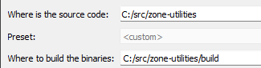

zone-utilities
==============

Various utilities and libraries for parsing, rendering and manipulating EQ Zone files.

1. [Download CMake](https://cmake.org/download/)
1. Open cmake, set source to this path, build path, build subdir, e.g.: 
1. Hit configure. Will show red, ignore for now.
1. Hit Generate. This makes a .sln file
1. Hit Open Project. This opens visual studio
1. Press F6 to build solution.
1. Files are in build/bin/